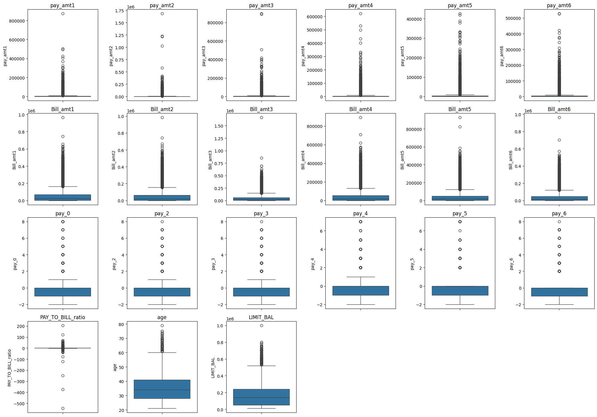

# Credit Card Default Prediction

A supervised machine learning project to classify credit card customers as **defaulters** or **non-defaulters** based on their payment and billing history, enabling proactive risk management for financial institutions.

## Table of Contents
- [Overview](#overview)
- [Tech Stack](#tech-stack)
- [Dataset](#dataset)
- [Exploratory Data Analysis](#exploratory-data-analysis)
- [Feature Engineering](#feature-engineering)
- [Handling Class Imbalance](#handling-class-imbalance)
- [Modeling Approach](#modeling-approach)
- [Evaluation Metrics](#evaluation-metrics)
- [Results](#results)
- [Model Selection by Business Strategy](#model-selection-by-business-strategy)
- [Key Takeaways](#key-takeaways)

## Overview

A credit card default occurs when a customer fails to make payments for an extended period. This project builds an end-to-end pipeline to:
- Identify the key behavioural and profile-based drivers of default
- Forecast the likelihood of a customer defaulting next month
- Compare model choices under different real-world banking strategies (revenue growth vs. loss minimization)

Models trained: **Logistic Regression, Decision Tree, XGBoost, LightGBM, AdaBoost, and Support Vector Machine (SVM)**.

## Tech Stack

- **Language:** Python
- **Machine Learning Models & Algorithms:**
  - **Logistic Regression** (`sklearn.linear_model.LogisticRegression`) — Linear probabilistic baseline classifier
  - **Decision Tree** (`sklearn.tree.DecisionTreeClassifier`) — Non-linear tree-based classifier
  - **XGBoost** (`xgboost.XGBClassifier`) — Extreme Gradient Boosting ensemble
  - **LightGBM** (`lightgbm.LGBMClassifier`) — Light Gradient Boosting Machine
  - **AdaBoost** (`sklearn.ensemble.AdaBoostClassifier`) — Adaptive Boosting ensemble
  - **Support Vector Machine (SVM / SVC)** (`sklearn.svm.SVC`) — Kernel-based classification
- **Preprocessing & Dimensionality Reduction:**
  - Principal Component Analysis (`sklearn.decomposition.PCA`)
  - Feature Scaling & Standardization (`sklearn.preprocessing.StandardScaler`)
  - Categorical Encoding (`pandas.get_dummies` / One-Hot Encoding)
- **Class Imbalance Handling:**
  - SMOTE: Synthetic Minority Over-sampling Technique (`imblearn.over_sampling.SMOTE`)
- **Evaluation & Threshold Tuning:**
  - F2-Score Optimization (`sklearn.metrics.fbeta_score` with $\beta=2$)
  - ROC-AUC (`sklearn.metrics.roc_auc_score`), Precision, Recall, F1-Score, Accuracy
  - Threshold sweeping across classification probabilities
- **Data Handling & Computation:** pandas, NumPy
- **Data Visualization:** matplotlib, seaborn

## Dataset

- **Size:** 25,247 entries, 26 original features (expanded to 32 after one-hot encoding categorical variables)
- **Target variable:** `next_month_default` — `1` if the customer defaulted the following month, `0` otherwise
- **Class distribution:** ~19% default (positive) vs. ~81% non-default (negative) → significant class imbalance


### Feature Descriptions

| Feature | Description |
|---|---|
| `Customer_ID` | Unique identifier; dropped as it holds no predictive value |
| `PAY_0, PAY_2 ... PAY_6` | Payment status per month. `-2` = no consumption, `-1` = fully paid, `0` = partial/minimum payment, `≥1` = months overdue |
| `MARRIAGE` | 1 = Married, 2 = Single, 3 = Others (invalid values mapped to "Others") |
| `SEX` | 1 = Male, 0 = Female |
| `EDUCATION` | 1 = Graduate School, 2 = University, 3 = High School, 4 = Others (invalid values mapped to "Others") |
| `LIMIT_BAL` | Assigned credit limit (avg. ≈ 168,342; range 10K–1M) |
| `AGE` | Customer age (mean ≈ 35.4 years; range 21–79) |
| `Bill_amt1 ... Bill_amt6` | Total bill amount per month (`>0`: owed money, `=0`: no spending, `<0`: overpaid) |
| `Pay_amt1 ... Pay_amt6` | Payment amount made per month toward the prior month's bill |

### Data Cleaning
- Dropped 126 null entries in `LIMIT_BAL` (negligible given dataset size)
- Removed duplicate records using `drop_duplicates()`
- One-hot encoded categorical variables (`SEX`, `MARRIAGE`, `EDUCATION`) to avoid imposing false ordinal relationships

## Exploratory Data Analysis

- **Gender vs. default:** Female customers outnumber male customers in both default and non-default groups, reflecting the overall gender split of the dataset.


- **Credit limit vs. age:** Aggregate credit limit peaks around ages 21–29, then steadily declines with age — likely because younger customers with recent, active credit histories are assigned higher limits, while usage and limits taper off for older customers.
- **Correlation analysis:**
  - `Bill_amt1` through `Bill_amt6` are strongly correlated with each other (~0.8–0.97)
  - `PAY_0` through `PAY_6` are strongly correlated with each other (~0.6–0.85)


  - Scatter plots confirm a clear linear trend among these collinear feature groups, motivating dimensionality reduction / feature selection


- **Outliers:** Present across nearly all numerical features (bill amounts, payment amounts, payment delays). Retained rather than removed, since they carry meaningful signal for default prediction and dropping them would cause significant data loss.



## Feature Engineering

Two complementary approaches were used to manage dimensionality and multicollinearity:

### 1. Domain-Knowledge Features

**Pay-to-Bill Ratio**
```
Pay_to_Bill = Total Payment Made / Total Bill Generated
```
- `0` = no payment made, `0.5` = half the bill paid, `1.0` = fully paid, `>1.0` = overpayment
- Highly right-skewed among defaulters — most defaulters made little to no payment relative to their bill, confirming non-payment as the dominant pre-default behavior.

**Utilization**
```
Utilization = Average Bill Generated / Credit Limit
```
- Captures what portion of available credit a customer is using — a well-known proxy for financial stress.
- Defaulters show a ~2:1 ratio between high utilization (>0.3) and low utilization (<0.1) groups, with a notable spike near zero utilization — potentially reflecting customers who stopped using their card just before defaulting.

**Weighted Average Delay (WAD)**

Assigns greater weight to more recent payment delays, since recent behavior is more predictive of near-term default risk:
```
WAD = (6·PAY_0 + 5·PAY_2 + 4·PAY_3 + 3·PAY_4 + 2·PAY_5 + PAY_6) / 21
```
- Normal payment behavior (`-1`, `-2`) → mapped to `0`
- Minimum payment behavior (`0`) → mapped to `0.5` to reflect residual risk
- Delayed payment behavior (`1`–`8`) → preserved on its original severity scale
- Non-defaulters cluster tightly between 0–0.6 with a sharp drop-off beyond that; defaulters are spread more broadly, with a long tail extending up to 7.0 — making WAD one of the most discriminative engineered features, particularly above the 0.6 threshold.


For the domain-knowledge approach, 22 features were retained: the three engineered features above, plus `PAY_0`, `PAY_2`, `Bill_amt1`, and `Bill_amt2` (most recent payment/bill signals). Highly collinear, older-lagged features (`PAY_3`–`PAY_6`, `Bill_amt3`–`Bill_amt6`) were dropped to reduce multicollinearity.


### 2. Principal Component Analysis (PCA)

- Applied **standardization** (z-score scaling) to all numerical features, fit only on the training set to prevent data leakage.
- Retained the **top 20 principal components**, which together explain 95% of the cumulative variance in the data.


## Handling Class Imbalance

With only ~19% positive (default) cases, an imbalance-aware strategy was necessary to avoid a biased model. **SMOTE (Synthetic Minority Oversampling Technique)** was applied to the training set:

- Selects a minority-class sample and its *k* nearest neighbors (default *k* = 5)
- Generates synthetic samples along the line segments connecting the sample to its neighbors
- Applied **only after** the train-test split (using training-set statistics) to prevent information leakage from the test set

## Modeling Approach

- **Train/test split:** 75/25, stratified on the target, performed *before* scaling and SMOTE to prevent leakage
- **Threshold tuning:** For each model, the classification threshold was swept and optimized for **F2 score** (rather than the default 0.5) to prioritize recall
- **Two parallel pipelines** were trained and compared: PCA-based features vs. domain-knowledge engineered features

## Evaluation Metrics

Given the imbalanced nature of the problem, accuracy alone is misleading — a naive "always predict non-default" model would already score ~81% accuracy while catching zero defaulters. The following metrics were used instead:

| Metric | Why it matters |
|---|---|
| **Recall** | Measures how many actual defaulters are correctly identified (`TP / (TP + FN)`). High priority — missing a defaulter (false negative) is costly. |
| **Precision** | Measures how many predicted defaulters are truly defaulters. |
| **F1 Score** | Harmonic mean of precision and recall. |
| **F2 Score** | Like F1, but weights recall more heavily than precision — the primary optimization target, since minimizing missed defaulters (false negatives) matters more than avoiding false alarms. |
| **ROC-AUC** | Measures overall separability between classes across all thresholds. |

## Results

### Approach 1: PCA-based Features (Top 22 Components)

| Model | Best Threshold | Accuracy | Precision | Recall | F1 | F2 | ROC-AUC |
|---|---|---|---|---|---|---|---|
| Decision Tree | 0.19 | 0.4648 | 0.2440 | 0.8202 | 0.3762 | 0.5571 | 0.6993 |
| XGBoost | 0.34 | 0.5390 | 0.2780 | 0.8411 | 0.4179 | 0.5986 | 0.7594 |
| LightGBM | 0.31 | 0.4921 | 0.2612 | 0.8654 | 0.4013 | 0.5917 | 0.7607 |
| Logistic Regression | 0.35 | 0.4339 | 0.2388 | 0.8587 | 0.3737 | 0.5653 | 0.7234 |
| AdaBoost | 0.49 | 0.3901 | 0.2350 | 0.9314 | 0.3753 | 0.5848 | 0.7526 |
| **SVM** | 0.30 | 0.4980 | 0.2649 | 0.8746 | 0.4067 | **0.5989** | 0.7554 |

> **Best performer:** SVM, with the highest F2 score (0.60) at 0.50 accuracy.

### Approach 2: Domain-Knowledge Engineered Features (22 Features)

| Model | Best Threshold | Accuracy | Precision | Recall | F1 | F2 | ROC-AUC |
|---|---|---|---|---|---|---|---|
| Decision Tree | 0.11 | 0.5590 | 0.2737 | 0.7508 | 0.4012 | 0.5567 | 0.6961 |
| XGBoost | 0.18 | 0.5648 | 0.2884 | 0.8261 | 0.4275 | 0.6017 | 0.7628 |
| **LightGBM** | 0.20 | 0.5839 | 0.2979 | 0.8219 | 0.4373 | **0.6080** | 0.7762 |
| Logistic Regression | 0.39 | 0.3906 | 0.2311 | 0.9013 | 0.3679 | 0.5704 | 0.6579 |
| AdaBoost | 0.49 | 0.7025 | 0.3643 | 0.6881 | 0.4764 | 0.5843 | 0.7485 |
| Support Vector Machine | 0.34 | 0.3590 | 0.2250 | 0.9239 | 0.3619 | 0.5699 | 0.6433 |

> **Best performer:** LightGBM, with the highest F2 score (0.61) at 0.58 accuracy — outperforming the best PCA-based model overall.

## Model Selection by Business Strategy

Since no single metric fits every business context, two models are recommended depending on the bank's risk appetite:

### 1. Revenue-Generating Banks
Focused on customer acquisition and retention, and willing to tolerate some default risk in exchange for fewer false positives (fewer good customers wrongly flagged as risky).

- **Recommended model:** AdaBoost (domain-knowledge features)
- **Rationale:** Best accuracy (0.70) among all models with an acceptable F2 trade-off (0.58)

### 2. Loss-Reduction Banks
Established banks with a strong existing customer base, prioritizing early detection of defaulters to minimize financial losses.

- **Recommended model:** LightGBM (domain-knowledge features)
- **Rationale:** Highest F2 score (0.61) — best at minimizing missed defaulters (false negatives)

## Key Takeaways

- Domain-knowledge feature engineering (Pay-to-Bill Ratio, Utilization, Weighted Average Delay) outperformed pure PCA-based dimensionality reduction across most models.
- Recent payment behavior (`PAY_0`, `PAY_2`) and recent bill amounts are more informative than older, highly collinear lagged features.
- No single model is universally "best" — model choice should align with a bank's specific risk strategy (growth vs. loss minimization).
- Class imbalance handling (SMOTE) combined with F2-optimized thresholding was essential, since a naive high-accuracy model would fail to catch the majority of defaulters.
